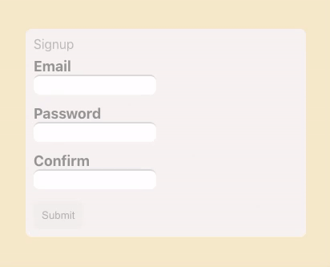
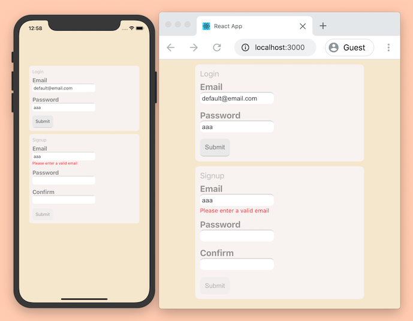

# zustand forms
*fast typesafe form states as zustand stores*



### Getting Started

*First install the package*
```ts
// package.json
"dependencies": { "zustand-forms": "bitbucket:conduct/zustand-forms" }
```
*Then define a form*
```ts
import { makeValidator, makeMakeFormStore, InputIdFromFormApi } from "zustand-forms";

// Define value types
const valueTypes = {
  text: { blankValue: "" },
  number: { blankValue: 0 },
  boolean: { blankValue: false },
};
// Define validators
const validatorFunctions = {
  required: makeValidator(({ value }) =>
    !value ? "Required field" : undefined
  ),
};
// Get form maker function
const makeFormStore = makeMakeFormStore(validatorFunctions, valueTypes);

// Make a form 🗒
export const [useLoginForm, loginFormApi] = makeFormStore({
  firstName: { valueType: "text", defaultValidators: ["required"] },
  lastName: { valueType: "text", defaultValidators: ["required"] },
});

```
*Then use the form store with components*
```tsx
type InputId = InputIdFromFormApi<typeof loginFormApi>;

const FormTextInput = ({ inputId }: { inputId: InputId }) => {
  const updateInput = useLoginForm((state) => state.updateInput);
  const toggleFocus = useLoginForm((state) => state.toggleFocus);
  const inputState = useLoginForm((state) => state.inputStates[inputId]);
  const { value, localErrorTextByErrorType } = inputState;
  return (
    <>
      <input
        type="text"
        value={value}
        onChange={(event) => updateInput({ inputId, newValue: event.target.value })}
        onFocus={() => toggleFocus({ inputId, isFocused: true })}
        onBlur={() => toggleFocus({ inputId, isFocused: false })}
      />
      <div>{Object.values(localErrorTextByErrorType).join(", ")}</div>
    </>
  );
};

const LoginForm = () => {
  const refreshForm = useLoginForm((state) => state.refreshForm);
  useEffect(refreshForm, []);
  return (
    <>
      <FormTextInput inputId="email" />
      <FormTextInput inputId="password" />
    </>
  );
};

```

optionally:

- combine multiple form stores to
    - get a `useFormInput` hook, with extra derived state and access to any form
    - get helper types like `FormName` and `InputIdByFormName`

*(larger complete example with `useFormInput` further down)*

### Why zustand-forms?
- *typesafe*, avoids issues with mismatching form names/inputIds, with autocomplete for speed
- *seperated state*, all form state's seperated from layout/views, the latest values are reachable from anywhere
- *flexible validation*, built in validation, supporting access to parameters and other form state
- *serverside errors*,  supports adding server errors so all form state is in one place

  
*The same form definition can be used for native and web*

# Recipes


### Submitting a form
```tsx
import { signupFormApi } from "forms/signupForm";
const SignupForm = () => <>
	    <FormInput inputId="email" formName="signup"   />
	    <FormInput inputId="newPassword" formName="signup"   />
        <button onClick={() => {
	       const { formValues } = signupFormApi.getState();
	       serverApi.submit(formValues);
	     }}> Submit </button>
      </>
```
This example uses signupFormApi instead of a hook to avoid rerenders when formValues update  
The formValues object contains `{ email: "example@email.org", password: "123" }`

### Disabling a submit button
```tsx
import { useSignupForm } from "forms/signupForm";
function SignupForm() {
  const isValid = useSignupForm((state) => state.isValid);
  return <>
	  <FormInput formName="signup" inputId="email" title="Email" />
	  <FormInput formName="signup" inputId="newPassword" title="Password" />
      <button disabled={!isValid}> Submit </button>
      </>
```

### Refreshing forms
For accurate state, forms can be "refreshed" when becoming visible, which allows states like `isEdited` to be up to date.  
Refreshing forms is also where setting **initial values** , **disabling validators**, and **updating server errors** can be done for inputs
#### Initialising with values
```ts
import { useSignupForm } from "forms/signupForm";
function SignupForm() {
  const refreshForm = useSignupForm((state) => state.refreshForm);
  useEffect(() => refreshForm({email: "initial@email.org"}), []);
```
#### Hiding inputs to validators
```ts
  useEffect(() => refreshForm({}, {email: false}), []);
```
#### Adding server errors
```ts
  useEffect(() => refreshForm({}, {}, {email: ["email already registered"]} []);
```
### Using validator utils
Use validator utils to quickly make regex based validators,  
the included regex's are `email` `aNumber` `aNonNumber` `anUppercaseLetter` `aLowercaseLetter` `aSpace` but more can be added/overwritten with the first parameter of `makeValidatorUtils`
```ts
import { makeValidatorUtils } from "zustand-forms";
const {
  isString,
  isTypedString,
  stringMatches,
  stringDoesntMatch,
} = makeValidatorUtils({
  aCustomRegex: /\s\S/,
});
```
##### isTypedString
`isTypedString` checks if the value is a non empty string, it can be useful for combining with string checks:  `if (isTypedString(value) && value.length > 5)`, most validators shouldn't return an error for an empty string if there's a seperate "required" validator
```ts
import { makeValidator } from "zustand-forms";
const validatorFunctions = {
  atleastTwoCharacters: makeValidator(({ value }) => {
    if (isTypedString(value) && value.length > 2) return "Required field"
  })}
```
##### stringDoesntMatch / stringMatches
`stringMatches` and `stringDoesntMatch` check if a typed string matches or doesn't match a named regex
```ts
import { makeValidator } from "zustand-forms";
const validatorFunctions = {
  email: makeValidator(({ value }) => {
    if (stringDoesntMatch(value, "email")) return "Please enter a valid email";
  })}
```

### Custom value types
Custom value types can be used for values with multiple properties,  like `beachBall: { color: "green", size: 30 }`.
```
const valueTypes = {
  text: { blankValue: "" },
  rotation: { blankValue: { x: 0, y: 0, z: 0 } },
};
```
Having default validators for custom value types can be useful,   
 use `getTypedMakeValidator`  instead of `makeValidator`  to have typed `value`s in validator functions

```ts
import { getTypedMakeValidator } from "zustand-forms";

const valueTypes = {
  text: { blankValue: "" },
  rotation: {
    blankValue: { x: 0, y: 0, z: 0 },
    defaultValidators: ["allowedRotation" as "allowedRotation"] // For now names need types, but requirement might be removed
  },
};

const makeValidator = getTypedMakeValidator(valueTypes);

const validatorFunctions = {
  allowedRotation: makeValidator(({ value /* string | Rotation */ }) => {
    if (isString(value)) return;
    // now the type is guarenteed to be a Rotation { x: number, y: number, z: number }

    const isValidAngle = (angle: number) => angle > 0 && angle < 360;
    if (!isValidAngle(value.x) || !isValidAngle(value.y) || !isValidAngle(value.z))
      return "Invalid rotation";
  }),
};
```

# States

### Input state
|  |   | ℹ️ |  
| - | ---------- | ------------- |
| | inputId  | "firstName"   |
|***values***  | value      | the current value  
| | initialValue  |   
| | valueType  |   | "text" |
|***validators***  | validatorTypes      | ["requiredLength"]  |
| | validatorsOptions  |   { requiredLength: { max: 10 } } |
|***current errors***  | localErrorTypes  |  [“requiredLength”]   |
| | localErrorTextByErrorType  |  { requiredLength: "Must be under 11 letters" }  |
| | serverErrorTexts  | [“Name already exists”]   |  
|***times***  | timeUpdated      |  1596601463296 |  
| | timeBecameCheckable  |   |  
| | timeBecameUncheckable  |   |  
| | timeFocused  |   |  
| | timeUnfocused  |   |  
|***booleans***  | isValidLocal      |   |  
| | isValidServer  |  if there are any current server errors |  
| | isValid  |   |  
| | isEdited  |   |  
| | hasBeenUnfocused  |   |  
| | isFocused  |   |  
| | isCheckable  | if the validators should run, usually for hidden inputs  |  


### Form state
|  |   | |  
| - | ---------- | ------------- |
|***inputIds***  | allInputIds      | ["firstName", "lastName"]
| | localErrorInputIds  |  
| | serverErrorInputIds  |   |
| | checkableInputIds  |   |
| | focusedInputId  |  "firstName" |
|***input states***  | inputStates      | { firstName: `InputState` }  |
| | formValues  |   { firstName: "Sam" } |
|***times***  | timeUpdated      |  1596601463296 |  
| | timeRefreshed  |   |  
| | timeFocused  |   |  
| | timeUnfocused  |   |  
|***booleans***  | isValidLocal      |   |  
| | isValidServer  |  if there are any current server errors |  
| | isValid  |   |  
| | isEdited  |   |  
| | hasBeenUnfocused  |   |  
| | isFocused  |   |  
| | isCheckable  | if the validators should run, usually for hidden inputs  |  


### Form actions
|  |   | |  |
| - | ---------- | ------------- | - |
| | updateInput      |  `updateInput`({`inputId`, `newValue`}`) ` | use in `<input onChange />`
| | toggleFocus  |  `toggleFocus`({`inputId`, `isFocused`}`)` | use in `<input onFocus onBlur />`
| | toggleIsCheckable  |  `toggleIsCheckable(`{`inputId`, `isCheckable`}`)` | use for hidden inputs
| | refreshForm  | `refreshForm(` `initialValuesByInputId`, `isCheckableByInputId`, `serverErrorsByInputId` `)`  | use when form components mount with `useEffect(, [])`


## Larger example
Folder layout

- 📂src
  - 📂forms
  - 📄 loginForm.ts
  - 📄 signupForm.ts
  - 📄 index.ts
    - 📂options
    - 📄 valueTypes.ts
    - 📄 validatorFunctions
    - 📄 index.ts (creates `makeFormStore`)
   - 📂components
     - 📄FormInput.tsx
   - 📄App.tsx

📄 valueTypes.ts
```ts
// Define value types
const valueTypes = {
  text: {
    blankValue: "",
    defaultValidators: [],
    defaultValidatorsOptions: {},
  },
  number: {
    blankValue: 0,
    defaultValidators: [],
    defaultValidatorsOptions: {},
  },
  boolean: {
    blankValue: false,
    defaultValidators: [],
    defaultValidatorsOptions: {},
  },
};
export default valueTypes;
```

📄 validatorFunctions.ts
```js
// Define validator functions
import { makeValidator as make, makeValidatorUtils } from "zustand-forms";

const {
  isString,
  isTypedString,
  stringMatches,
  stringDoesntMatch,
} = makeValidatorUtils({
  aCustomRegex: /\s\S/,
});

const validatorFunctions = {
  email: make<{}>(({ value }) => {
    if (stringDoesntMatch(value, "email")) return "Please enter a valid email";
  }),
  required: make<{ message: string }>(({ value, validatorOptions }) => {
    if (!isTypedString(value))
      return validatorOptions.message || "Required field";
  }),
  requiredLength: make<{ min?: number; max?: number }>(
    ({ value, validatorOptions: { min, max } }) => {
      if (!isTypedString(value)) return;

      if (min !== undefined && value.length < min)
        return `must be atleast ${min} characters`;

      if (max !== undefined && value.length > max)
        return {
          message: `must be less than ${max + 1} characters`,
          editedValue: value.substring(0, max),
        };
    }
  ),
  matchesOtherField: make<{ otherInputId: string; message?: string }>(
    ({ value, formState, validatorOptions: { otherInputId, message } }) => {
      const otherValue = formState.inputStates[otherInputId].value;
      const bothValuesArentEmpty = value !== "" && otherValue !== "";
      const valuesDontMatch = value !== otherValue;

      if (bothValuesArentEmpty)
        return {
          message: valuesDontMatch ? message : undefined,
          revalidateOtherInputIds: [otherInputId],
        };
    }
  ),
};

export default validatorFunctions;
```

📄 options/index.ts
```ts
// Create the `makeFormStore` function
import { makeMakeFormStore } from "zustand-forms";
import validatorFunctions from "./validatorFunctions";
import valueTypes from "./valueTypes";

const makeFormStore = makeMakeFormStore(validatorFunctions, valueTypes);

export default makeFormStore;
```

📄 signupForm.ts
```ts
import makeFormStore from "./options";

export const [useSignupForm, signupFormApi] = makeFormStore({
  email: {
    valueType: "text",
    defaultValidators: ["required", "email", "requiredLength"],
    defaultValidatorsOptions: {
      requiredLength: { max: 64 },
    },
  },
  newPassword: {
    valueType: "text",
    defaultValidators: ["required", "matchesOtherField"],
    defaultValidatorsOptions: {
      required: { message: "A Password's required (custom message)" },
      matchesOtherField: {
        // message: undefined // no message returned means "confirmPassword" gets revalidated when "newPassword" updates,
        // but there won't be any error for this input
        otherInputId: "confirmPassword",
      },
    },
  },
  confirmPassword: {
    valueType: "text",
    defaultValidators: ["required", "matchesOtherField"],
    defaultValidatorsOptions: {
      matchesOtherField: {
        message: "must match passsword",
        otherInputId: "newPassword",
      },
    },
  },
});
```

📄 forms/index.ts


```ts
// Optional forms helpers
// can help for an any-form FormInput component
import { useLoginForm, loginFormApi } from "./loginForm"; // another example form (not shown)
import { useSignupForm, signupFormApi } from "./signupForm";
import { makeFormHooks, MakeFormStoresHelperTypes } from "zustand-forms";

// Add all form stores keyed by form name
const formStores = {
  login: { hook: useLoginForm, api: loginFormApi },
  signup: { hook: useSignupForm, api: signupFormApi },
};

// Make forms hooks
const { useFormInput } = makeFormHooks(formStores);
export { useFormInput };

// Make forms types
type FormStoresHelperTypes = MakeFormStoresHelperTypes<typeof formStores>;
export type FormName = FormStoresHelperTypes["FormName"]; // "login" | "signup"
export type InputIdByFormName = FormStoresHelperTypes["InputIdByFormName"]; // InputIdByFormName["login"] -> "email" | "password"

export default formStores;
```
📄 components/FormInput.ts
```tsx
import React from "react";
import TextInput from "components/inputs/TextInput";
import { useFormInput, FormName, InputIdByFormName } from "forms";

type Props<T_FormName, T_InputId> = {
  inputId: T_InputId;
  formName: T_FormName;
  title: string;
};

const FormInput = <
  T_FormName extends FormName,
  T_InputId extends InputIdByFormName[T_FormName]
>({
  formName,
  inputId,
  title,
}: Props<T_FormName, T_InputId>) => {
  const {
    onChange,
    value,
    onFocus,
    onBlur,
    inlineErrorTexts, // local and server error texts in an array
    latestVisibleInlineErrorTexts, // same as inlineErrorTexts, but never empty, for fade transitions
    isFocused,
    hasVisibleErrors,
  } = useFormInput({
    inputId,
    formName,
  });

  return (
    <div css={styles.container}>
      <div css={styles.title}>{title}</div>
      <TextInput
        {...{ onFocus, onBlur }}
        onChange={onChange}
        value={value as string}
        style={{
          borderTopColor: isFocused ? "rgb(204, 232, 231)" : undefined,
          backgroundColor: isFocused ? "rgb(228, 255, 254)" : undefined,
        }}
      />
      {
        <div
          css={styles.errors}
          aria-hidden={!hasVisibleErrors}
          style={{
            height: hasVisibleErrors ? "16px" : "1px",
            opacity: hasVisibleErrors ? "1" : "0",
          }}
        >
          {latestVisibleInlineErrorTexts.join(", ")}
        </div>
      }
    </div>
  );
};
```


📄 App.tsx
```tsx
import React, { useEffect } from "react";
import "./App.css";
import FormInput from "components/FormInput";
import ExampleSubmitButton from "components/ExampleSubmitButton";
import { useSignupForm } from "forms/signupForm";

function App() {
  const refreshSignupForm = useSignupForm((state) => state.refreshForm);
  const isSignupFormValid = useSignupForm((state) => state.isValid);
  useEffect(() => refreshSignupForm(), []);

  return (
    <div className="App">
      <FormInput formName="signup" inputId="email" title="Signup email" />
      <FormInput formName="signup" inputId="newPassword" title="Password" />
      <FormInput formName="signup" inputId="confirmPassword" title="Confirm" />
      <ExampleSubmitButton isValid={isSignupFormValid} />
    </div>
  );
}
```

## Development
The easiest way to edit this package add `📂src` to your project as a renamed local folder like `📂zustand-forms-dev`, and replacing imports from `"zustand-forms"` to `"zustand-forms-dev"`.  
Enabling `"baseUrl":` in `tsconfig.json` allows non-relative imports

## TODO
- update readme with more info
